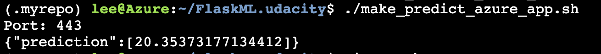

# FlaskML.udacity

## Overview

The goal of this project is to learn how to build a continuous delivery pipeline using Azure. When you push a new commit to the project, the built pipeline will build, test, and deploy the change to your azure service. You can refer to the below image. 


### Project Plan

We adopt spreadsheet and Trello as a weekly planner and a ticket system, respectively.
We share our plan using the links to the spreadsheet and Trello board:

* [The link to the spreadsheet](https://docs.google.com/spreadsheets/d/13OMxyuo_yzPh713XNW5niLp2SbMff53pCP-qgk3LD7A/edit?usp=sharing)
* [The link to the Trello board](https://trello.com/b/ruJQ2aIj/flaskml)


### Prerequisites

You need to create the following accounts:

* [A github account](https://github.com/)
* [An Azure account and an activated Azure cloud shell](https://azure.microsoft.com/en-us/free/)


## Instructions

### 1. Set Up the Project and Run Local Test

First, you need to clone this project on your Azure Cloud Shell.
The result will be similar to the following image:
<div>

</div>

After that, you need to create a python virtual environment and activate it.

```bash
~$> python3 -m venv ~/.myrepo
~$> source ~/.myrepo/bin/activate
```

Run the below commands and check whether the code passes the local tests.

```bash
~$> cd FlaskML.udacity
~/FlaskML.udacity$> make all
```

If successful, you will get results similar to the following image:
<div>

</div>

### 2. Configure Github Action as a Continuous Integration (CI) Pipeline

First, go to your GitHub repository and enable Github Action.
Checkout the provided [yml file](https://github.com/postBG/FlaskML.udacity/blob/main/.github/workflows/main.yml) configuring the automated build, lint, and test.
If you enabled Github Action correctly, Github Action would build the code automatically, and you will get the following results:
<div>

</div>

### 3. Implement a Continuous Delivery (CD) Pipeline with Azure Pipeline

Before implementing a continuous delivery pipeline, you need to deploy the Flask Application with Azure Web App. Run the following command on your Azure Cloud Shell:

```bash
~/FlaskML.udacity$> az webapp up -n flask-ml-udacity
```

You can validate the web service like the following image:
<div>

</div>

Or, You can check out your service by visiting `https://flask-ml-udacity.azurewebsites.net/`:
<div>

</div>

Now, you are ready to create a continuous delivery pipeline. 

Go to [Azure DevOps](https://dev.azure.com/) and sign in. Then, create a new project and move to the project. You will see the following page:
<div>

</div>

Move to the setting page by clicking the left below button. On the setting page, you need to create three service connections: a connection to Azure subscription, a connection to the Azure web app, and a Github account connection. Check out the below image and click the blue button to create the connections.
<div>

</div>

If you create the connections propely, you will get results similar to the below image.
<div>

</div>

Now, move to the pipeline page using the side bar and make the pipeline by clicking the blue button.
<div>

</div>

Click `Github (YML)` and choose your proper repository.
<div>

</div>
<div>

</div>

Finally, change variables properly and click run button.
<div>

</div>

### 4. Validate your CI / CD pipelines

If you've followed the above steps successfully, the pipeline will build, test, and deploy your source code whenever you push a new commit to your Github repository. To validate the process, let's change `app.py` just like the below image.
<div>

</div>

You can check the process at [Azure DevOps](https://dev.azure.com/) and your web app page. Note that the prediction should not be changed:
<div>

</div>
<div>

</div>
<div>

</div>

Again, you can check the log stream of the Flask app at `https://<app-name>.scm.azurewebsites.net/api/logs/docker`.
<div>

</div>

Additionally, you can check out [this official document](https://docs.microsoft.com/en-us/azure/devops/pipelines/ecosystems/python-webapp?view=azure-devops) to validate your configurations.

## Futureworks

The project always deploys the application whenever the code is changed. Sometimes, this can be inefficient. For example, if you add a new unit test but not modify the production code, deploy a whole new service might be wasteful. Therefore, Replacing the deployment step from those cases would be helpful.


